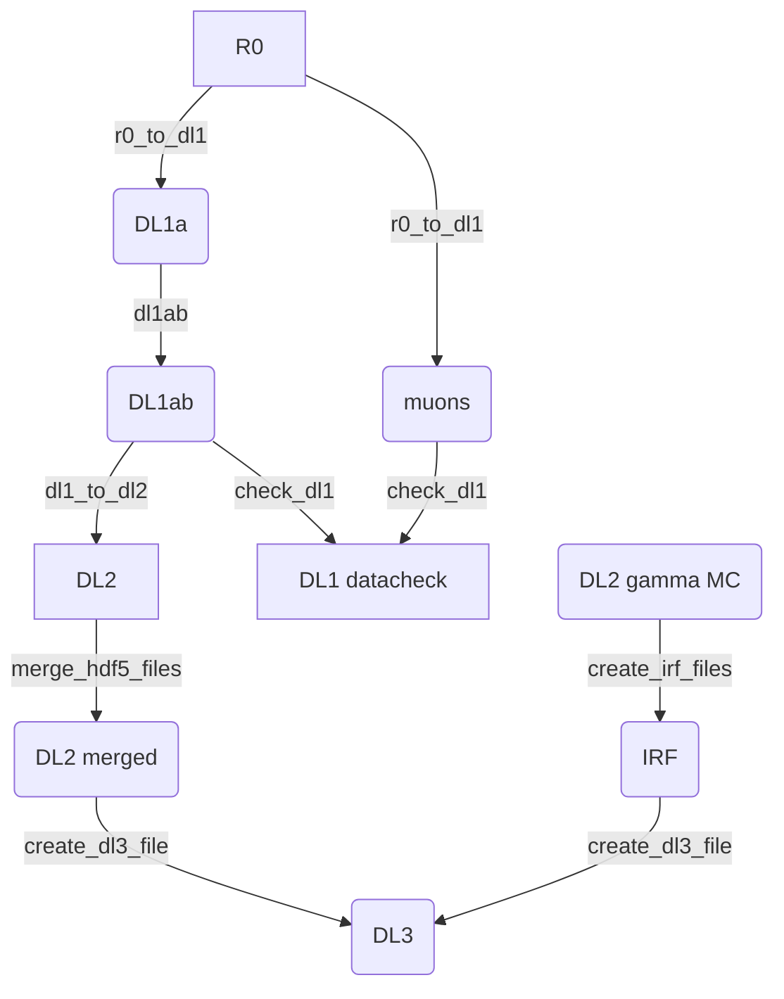

# lstosa

  [](https://github.com/cta-observatory/lstosa/actions/workflows/ci.yml)
  [](https://lstosa.readthedocs.io/en/latest/?badge=latest)
  [](https://codecov.io/gh/cta-observatory/lstosa)
  [](https://www.codacy.com/gh/cta-observatory/lstosa/dashboard?utm_source=github.com&amp;utm_medium=referral&amp;utm_content=cta-observatory/lstosa&amp;utm_campaign=Badge_Grade)


On-Site processing pipeline for the the Large Size Telescope prototype
of [CTA](https://www.cta-observatory.org/) (Cherenkov Telescope Array).

This is a prototype data processing framework under development based on
[cta-lstchain](https://github.com/cta-observatory/cta-lstchain) .

-   Code: <https://github.com/cta-observatory/lstosa>
-   Docs: <https://lstosa.readthedocs.io/>
-   License:
    [BSD-3-Clause](https://github.com/cta-observatory/lstosa/blob/main/LICENSE)

# Install

-   Install miniconda first.
-   Create and activate the conda environment including
    [cta-lstchain](https://github.com/cta-observatory/cta-lstchain) and
    [ctapipe_io_lst](https://github.com/cta-observatory/ctapipe_io_lst):

```bash
git clone https://github.com/cta-observatory/lstosa.git
cd lstosa
conda env create -n osa -f environment.yml
conda activate osa
```

In case you want to install the lstchain master version instead of a fixed tag you can run inside the `osa` environment:

```bash
pip install git+https://github.com/cta-observatory/cta-lstchain
```

- To update the environment (provided dependencies get updated) use:

```bash
conda env update -n osa -f environment.yml
```

- Install `lstosa`:

```bash
pip install .
```

# Data workflow


