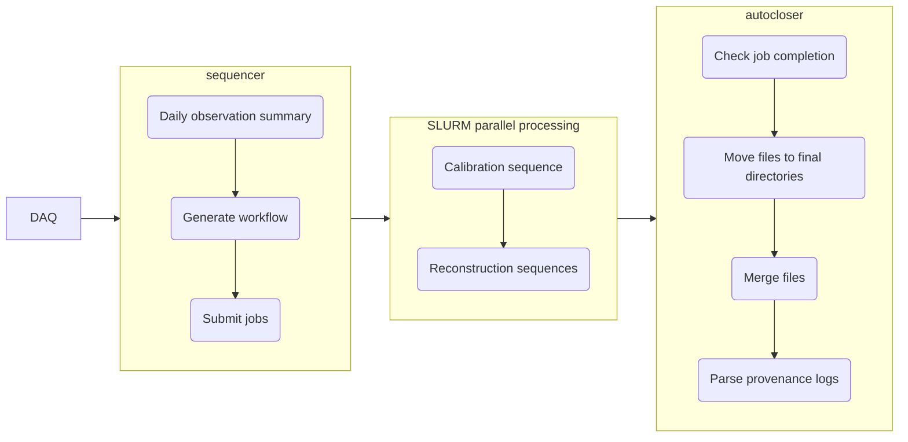
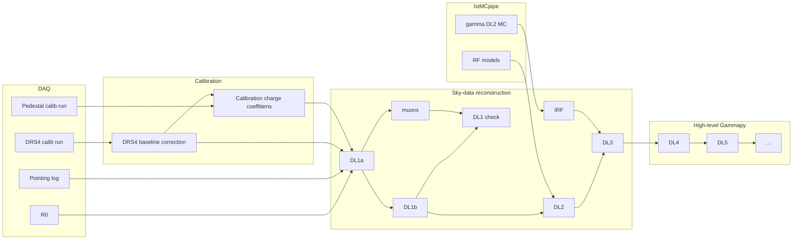

# lstosa

  [](https://github.com/cta-observatory/lstosa/actions/workflows/ci.yml)
  [](https://lstosa.readthedocs.io/en/latest/?badge=latest)
  [](https://codecov.io/gh/cta-observatory/lstosa)
  [](https://app.codacy.com/gh/cta-observatory/lstosa/dashboard?utm_source=gh&utm_medium=referral&utm_content=&utm_campaign=Badge_grade)
  [](https://pypi.org/project/lstosa/)
  [](https://doi.org/10.5281/zenodo.6567234)


Onsite processing pipeline for the Large-Sized Telescope prototype (LST-1) of [CTAO](https://www.cta-observatory.org/) (Cherenkov Telescope Array Observatory) based on [cta-lstchain](https://github.com/cta-observatory/cta-lstchain) running on the LST-1 IT onsite data center at Observatorio Roque de los Muchachos (La Palma, Spain). It automatically carries out the next-day analysis of observed data using cron jobs, parallelizing the processing using the job scheduler SLURM. It provides data quality monitoring and tracking of analysis products' provenance. Moreover, it also massively reprocesses the entire LST-1 dataset with each cta-lstchain major release.

 - Code: <https://github.com/cta-observatory/lstosa>
 - Docs: <https://lstosa.readthedocs.io/>
 - License: [BSD-3-Clause](https://github.com/cta-observatory/lstosa/blob/main/LICENSE)

## Install
We recommend using an isolated conda environment.
 - Install mamba/miniconda first.
 - Clone the repository, create and activate the conda environment using the `environment.yml` file:

    ```bash
    git clone https://github.com/cta-observatory/lstosa.git
    cd lstosa
    conda env create -n osa -f environment.yml
    conda activate osa
    ```

Then install `lstosa` as a **user** with: `pip install lstosa`, or as a **developer** with: `pip install -e .`. To install test, docs dependencies use `pip install -e .[test]`, `pip install -e .[doc]` or simply `pip install -e .[all]`

In case you want to install the lstchain development version instead of a fixed tag, you can run inside the `osa` environment:

```bash
pip install git+https://github.com/cta-observatory/cta-lstchain
```

To update the environment (provided dependencies get updated), use:

```bash
conda env update -n osa -f environment.yml
```

> **Note** to developers: to enforce a unique code convention, please install pre-commit (pre-commit install) after cloning the repository and creating the conda environment. This will black the committed files automatically.

## Workflow management
`lstosa` workflow is handled daily by the `sequencer` script, which identifies which observations are to be processed, generates the analysis workflow, and submits the jobs. A first calibration job produces the daily calibration coefficients. Subsequently, data reconstruction jobs are scheduled on a subrun-wise basis (1 job corresponds to around 10 seconds of observed data, and its processing up to DL2 takes about 30-40 mins).



## Usage
To use lstosa, you will first need to symlink some auxiliary files in a similar directory tree structure to the standard data production and set the paths correctly in your lstosa configuration file. Then to process all the runs from a given date, you can run the following command (use first the `--simulate` option to dry-run without actually submitting jobs):

```bash
sequencer --config your_osa_config.cfg --date YYYY-MM-DD LST1
```

Once all jobs finish, the `autocloser` script checks job completion, merges files, moves them to their final directories, and parses provenance logs.

```bash
autocloser --config your_osa_config.cfg --date YYYY-MM-DD LST1
```

## Dataflow



> **Warning**: standard production of DL3 data and higher-level results is still under development.
