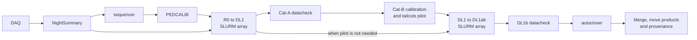
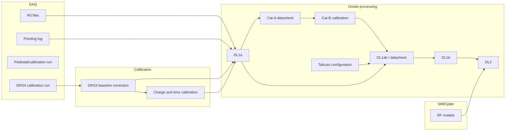

# lstosa

  [](https://github.com/cta-observatory/lstosa/actions/workflows/ci.yml)
  [](https://lstosa.readthedocs.io/en/latest/?badge=latest)
  [](https://codecov.io/gh/cta-observatory/lstosa)
  [](https://app.codacy.com/gh/cta-observatory/lstosa/dashboard?utm_source=gh&utm_medium=referral&utm_content=&utm_campaign=Badge_grade)
  [](https://pypi.org/project/lstosa/)
  [](https://doi.org/10.5281/zenodo.6567234)


Onsite processing pipeline for the Large-Sized Telescope prototype (LST-1) of [CTAO](https://www.cta-observatory.org/) (Cherenkov Telescope Array Observatory) based on [cta-lstchain](https://github.com/cta-observatory/cta-lstchain), running on the LST-1 IT onsite data center at Observatorio Roque de los Muchachos (La Palma, Spain). It automatically carries out the next-day analysis of observed data using cron jobs, parallelizing the processing with the SLURM job scheduler. It provides data quality monitoring and tracking of analysis-product provenance. It can also massively reprocess the entire LST-1 dataset for each cta-lstchain major release.

 - Code: <https://github.com/cta-observatory/lstosa>
 - Docs: <https://lstosa.readthedocs.io/>
 - License: [BSD-3-Clause](https://github.com/cta-observatory/lstosa/blob/main/LICENSE)

## Install

We recommend using an isolated conda environment.

- Install mamba or miniconda first.
- Clone the repository, create the conda environment from `environment.yml`, and activate it:

    ```bash
    git clone https://github.com/cta-observatory/lstosa.git
    cd lstosa
    conda env create -n osa -f environment.yml
    conda activate osa
    ```

Then install `lstosa` as a **user** with `pip install lstosa`, or as a **developer** with `pip install -e .`. To install testing or documentation dependencies, use `pip install -e .[test]`, `pip install -e .[doc]`, or simply `pip install -e .[all]`.

To install the development version of lstchain instead of a fixed tag, run the following command inside the `osa` environment:

```bash
pip install git+https://github.com/cta-observatory/cta-lstchain
```

To update the environment when dependencies change, use:

```bash
conda env update -n osa -f environment.yml
```

> **Note for developers:** To enforce a common code convention, install pre-commit (`pre-commit install`) after cloning the repository and creating the conda environment. It will format the committed files automatically.

## Workflow management

The `lstosa` workflow is orchestrated daily by the `sequencer` script. It reads the observation summary, builds the jobs required for each run, checks the current SLURM state, and submits only the jobs that are needed. Jobs are submitted per run and, where appropriate, as SLURM arrays with one task per subrun.

For a `DATA` run, the processing is divided into the following stages:

1. **R0 to DL1:** produces the DL1a files and the per-subrun Cat-A datacheck.
2. **Cat-A datacheck merge:** merges the per-subrun Cat-A datachecks into a per-run product.
3. **Cat-B and tailcuts:** runs `catb_tailcuts_pipeline` when Cat-B calibration or a non-standard tailcuts configuration is required.
4. **DL1 to DL1ab:** produces the DL1b files using the Cat-B calibration and/or tailcuts configuration when applicable.
5. **DL1b datacheck:** checks the DL1b products.
6. **Closing:** the `autocloser` merges and moves the final products, collects provenance, and launches the long-term datachecks.

The dependencies between the jobs are managed with SLURM `afterok` dependencies. In the usual case, the workflow is:

```text
PEDCALIB -> R0/DL1 + Cat-A datacheck -> Cat-B/tailcuts -> DL1ab + DL1b datacheck
```

When Cat-B and tailcuts processing is not required, the DL1ab job depends directly on the R0/DL1 job. The sequencer also detects active jobs and completed history entries to avoid submitting duplicates.


```mermaid
flowchart LR
    daq[DAQ] --> summary[NightSummary]
    summary --> sequencer[sequencer]
    sequencer --> calibration[PEDCALIB]
    calibration --> r0[R0 to DL1\nSLURM array]
    summary --> r0
    r0 --> catA[Cat-A datacheck]
    catA --> pilot[Cat-B calibration\nand tailcuts pilot]
    pilot --> dl1ab[DL1 to DL1ab\nSLURM array]
    r0 -->|when pilot is not needed| dl1ab
    dl1ab --> check[DL1b datacheck]
    check --> autocloser[autocloser]
    autocloser --> products[Merge, move products\nand provenance]
```

## Usage

Before running `lstosa`, configure the required paths and auxiliary files in the OSA configuration file. To process all runs from a given date, use `--simulate` first to inspect the jobs without submitting them:

```bash
sequencer \
    --config your_osa_config.cfg \
    --date YYYY-MM-DD \
    --simulate \
    LST1
```

When the dry run is correct, submit the jobs with:

```bash
sequencer --config your_osa_config.cfg --date YYYY-MM-DD LST1
```

Useful sequencer options include:

- `--input-state {legacy_raw,gain_selected,catA_calibrated}`: declares the preprocessing state of the input data.
- `--no-submit`: creates or updates job scripts without submitting them.
- `--no-calib`: skips the calibration job and assumes that calibration products already exist.
- `--no-dl1ab`: disables the DL1ab stage.
- `--force-submit`: submits jobs even when the normal dependency checks cannot be satisfied.
- `--overwrite-catB`: overwrites existing Cat-B calibration products.
- `--overwrite-tailcuts`: overwrites existing tailcuts configuration files.

The Cat-B/tailcuts stage can also be run for an individual run when needed:

```bash
catb_tailcuts_pipeline \
    --config your_osa_config.cfg \
    --date YYYY-MM-DD \
    RUN_ID LST1
```

Once the processing jobs finish, run the `autocloser` to check job completion, merge files, move them to their final locations, and parse provenance logs:

```bash
autocloser --config your_osa_config.cfg --date YYYY-MM-DD LST1
```

The sequencer stores a human-readable snapshot in `sequencer_table.txt`. Per-subrun history files are used to resume incomplete processing, while global run history entries record completed array stages.

## Data products and datachecks

The R0/DL1 job produces DL1a files and their per-subrun Cat-A datachecks. Cat-A datachecks are stored below:

```text
datacheck_cat_a/
```

The Cat-B/tailcuts pilot merges these files before modifying or reprocessing the DL1 products. At the end of the night, `autocloser` creates the long-term Cat-A datacheck. The regular DL1 and DL1b datachecks are then handled by the existing data-check and copy workflows.

## Dataflow


```mermaid
graph LR
    subgraph DAQ
        R0[R0 files]
        DRS4[DRS4 calibration run]
        PED[Pedestal/calibration run]
        POINT[Pointing log]
    end

    subgraph Calibration
        C1[DRS4 baseline correction]
        C2[Charge and time calibration]
        DRS4 --> C1 --> C2
    end

    subgraph Onsite processing
        A[DL1a]
        CA[Cat-A datacheck]
        B[Cat-B calibration]
        TC[Tailcuts configuration]
        AB[DL1ab / datacheck]
        CHECK[DL1b]
        DL2[DL2]
        R0 --> A
        POINT --> A
        C1 --> A
        C2 --> A
        A --> CA --> B
        B --> AB
        TC --> AB
        A --> AB
        AB --> CHECK --> DL2
    end

    subgraph lstMCpipe
        RF[RF models]
    end

    RF --> DL2
```

> **Warning:** standard production of DL3 data and higher-level results is still under development.
