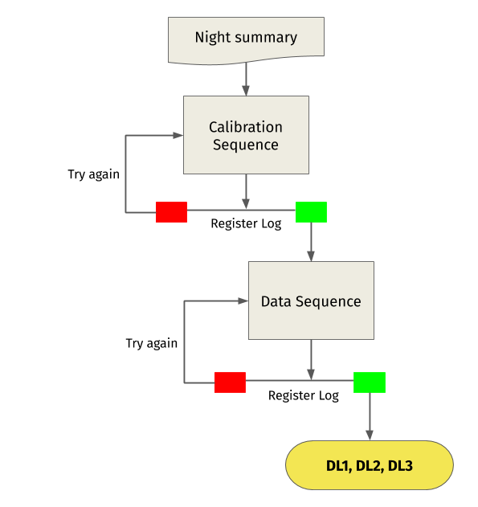

.. _introduction:

Introduction
 ************

LSTOSA is born out of experience gained on *On-Site Analysis* (OSA) of the MAGIC
data pipeline. Due to the large size of the daily recorded data, transferring the raw data 
through the network connection from La Palma island to continental Europe in
due time is an issue for the LST.
Therefore a fast *LST On-Site Analysis* (LSTOSA) chain is being developed, aimed at performing
a reduction the raw data at LST site, so that the high level data can be
delivered by internet to the CTA data centers.

The basic scheme is shown in the :numref:`data flow`:

.. _data flow:

    Data flow scheme of LST onsite analysis.

