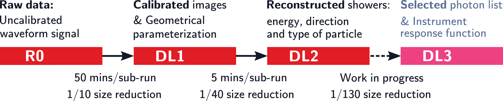

.. _introduction:

************
Introduction
************

+++++++++++++++++++++++++
Cherenkov Telescope Array
+++++++++++++++++++++++++
The `Cherenkov Telescope Array CTA`_, is the next generation of ground-based Cherenkov telescopes observing the
gamma-ray sky in the energy range  20 GeV - 300 TeV. The array will be composed of imaging atmospheric Cherenkov
telescopes of three different sizes distributed into two sites, one in the northern hemisphere in the Canary Island
of La Palma (Spain) and another located in the southern hemisphere at Paranal Observatory (Chile).

The prototype for CTA of the `Large-Sized Telescope LST-1`_, located at the Observatorio del Roque de Los Muchachos
(ORM) in La Palma, is presently going through its commissioning phase. It is placed next to the two
`MAGIC (Major Atmospheric Gamma Imaging Cherenkov) telescopes`_, which is an advantage for the operation, maintenance
and calibration of the telescope. A total of four LSTs, among other different-size telescopes, will operate together
at ORM as part of the CTA North (CTA-N) site.

.. _`Cherenkov Telescope Array CTA`: https://www.cta-observatory.org
.. _`Large-Sized Telescope LST-1`: https://www.cta-observatory.org/project/technology/lst/
.. _`MAGIC (Major Atmospheric Gamma Imaging Cherenkov) telescopes`: https://magic.mpp.mpg.de/

++++++
LSTOSA
++++++

LSTOSA is born out of experience gained on *On-Site Analysis* (OSA) of the MAGIC processing pipeline. Due to the
large size of the daily recorded data, transferring the raw data through the network connection from La Palma island
to continental Europe in due time is an issue for the LST-1. Therefore a fast *LST On-Site Analysis* (LSTOSA) chain
is being developed, aimed at performing a reduction of the raw data at the LST-1 site, so that the low and intermediate
analysis products are available to the LST Collaboration and delivered by internet to the CTA data centers.
The pipeline also performs data quality checks to debug potential problems. To ensure reproducibility
LSTOSA tracks the provenance of the analysis products.

++++++++++++++++++++
Data reduction steps
++++++++++++++++++++

Data analysis steps implemented in `lstchain`_ are summarized in :numref:`reduction_steps`:

   Data reduction steps, starting from raw uncalibrated waveform signals to selected photon lists.

.. _`lstchain`: https://github.com/cta-observatory/cta-lstchain

++++++++++++++++++++++++
Computing infrastructure
++++++++++++++++++++++++

An *IT Container* housing a compact data center, placed next to the telescope, allows us to record and
process the data acquired by the telescope (data acquisition rate 3 TB per hour of observation), including LSTOSA
pipeline data processing. The data center provides 55 computing nodes, each one with 32 cores, for a total of
1760 cores and 3.5 PB of disk space. This cluster uses the CentOS operating system, administers the work load
through the `SLURM`_ batch scheduling system and implements the Fujitsu Scalable File System **FEFS** based on Lustre.

Once the data have been recorded and processed, they are copied via the network to the computing center PIC
(Port d'Informació Científica) located in Barcelona. The members of the LST Collaboration have access to the
so called *IT Container* and use it for the commissioning of the telescopes and preliminary astrophysics
analysis. The vast computing power available in the *IT Container* is key to make possible the processing
of LST-1 data.

.. _`SLURM`: https://slurm.schedmd.com/