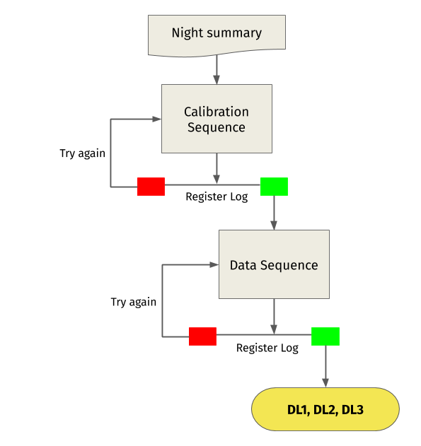

.. _workflow:

Workflow
********

The workflow process starts with a summary of the observations of the night, it is then decomposed in sequences
of observations and calibrations. A pilot job is built for each sequence, and they are sent to the scheduling
system SLURM, which takes care of allocating the resources and provides a first level of parallelization.

Each observation, usually called a *run* is normally composed of a set of ~100 files sometimes
called *sub-runs*, each one comprising less than 10 seconds of data taking. The pilot jobs launch one job
for each sub-runs comprising the observation, using the SLURM job array capabilities. This provides a
second level of parallelization. Once all jobs are finished, the results are copied to the final storage
locations and merged, where data check plots are provided to the collaboration through a web interface.

Step by step:

1. A cron job creates a list of all the runs taken in the night which takes around 10 minutes. The list is written in
   the **NightSummary** file. An example is shown below:

.. code-block:: bash

     01872    5 DRS4  2020-01-27 19:51:44 0001 1580154753739954334 5739954100 0001 1580154753739954334 5739951300
     01873    5 CALI  2020-01-27 20:23:43 0001 1580156670887160057 1887159800 0001 1580156670887160057 1887158800
     01874  194 DATA  2020-01-27 20:44:13 0003 1580157904186709543 5186709300 0003 1580157904186709543 5186708700
     01875  209 DATA  2020-01-27 21:05:44 0003 1580159197411578464 7411578200 nan nan nan
     01876  225 DATA  2020-01-27 21:27:20 0001 1580160490575729635 7575729400 nan nan nan
     01877  202 DATA  2020-01-27 21:51:28 0001 1580161935735383476 1735383200 nan nan nan
     01878   74 DATA  2020-01-27 22:13:34 0001 1580163263237149740 2237149500 nan nan nan
     01879  207 DATA  2020-01-27 22:33:06 0003 1580164436408793971 3408793700 nan nan nan
     01880  203 DATA  2020-01-27 22:55:31 0003 1580165786211720504 7211720200 nan nan nan
     01881  207 DATA  2020-01-27 23:17:52 0001 1580167122989548546 3989548300 nan nan nan

2. A **sequencer** script prepares a job for each run. There is always a first calibration sequence which produces
   the DRS4 pedestal, charge and time calibration files. The rest of the sequences correspond to sky-data runs which
   make use of the previously produced calibration files.

3. These jobs are sent to the **SLURM** batch system as array jobs which process each subrun in parallel.

4. In each **subrun** two steps are performed:

   A. **R0 to DL1**: DL1 file production, DL1 datacheck and muon analysis. In this step low and high level (TBC)
      calibration of the camera images is performed, afterward a cleaning is applied and the remaining images are
      parameterized to obtain the so-called Hillas parameters. All together take around 50 minutes per sub-run.

   B. **DL1 to DL2**: DL2 event-wise files are generated containing reconstructed energy, direction and type of
      particle. Previously trained RF models are applied to perform the reconstruction. This step takes a few minutes
      per sub-run.

5. A **closer script** checks all the sequences and merges the subrun results. Files are moved to are moved to
   their final locations.

6. Data check plots are transferred to the LST-1 data-check web server (password protected)

- DRS4 calibration data-check: http://www.lst1.iac.es/datacheck/drs4/
- Excess noise factor calibration data-check: http://www.lst1.iac.es/datacheck/enf_calibration/
- DL1 data-check (including also a long-term DL1 check): http://www.lst1.iac.es/datacheck/dl1/

The basic scheme is shown in :numref:`data_flow`:

   Data flow scheme of LST onsite analysis.