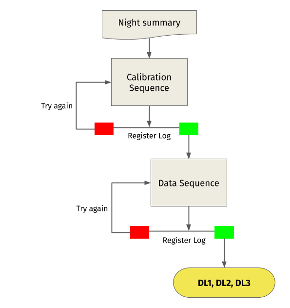

.. _workflow:

Workflow
********

The LSTOSA workflow is driven by the observation summary of a night. The
summary is converted into calibration and data sequences, and the ``sequencer``
creates and submits the SLURM jobs required by each sequence. DATA runs are
processed at subrun level: a run contains multiple subruns, and each SLURM
array task processes one subrun.

Unlike the previous single-job workflow, the current sequencer separates the
processing into stages. It tracks each stage in the history files and uses
SLURM dependencies to make sure that a job starts only after its inputs are
ready.

Night summary
=============

A cron job or the data-check system creates a list of the runs taken during the
night. The list is written in the **NightSummary** file. A representative
example is:

.. code-block:: text

     01872    5 DRS4  2020-01-27 19:51:44 0001 1580154753739954334 5739954100 0001 1580154753739954334 5739951300
     01873    5 CALI  2020-01-27 20:23:43 0001 1580156670887160057 1887159800 0001 1580156670887160057 1887158800
     01874  194 DATA  2020-01-27 20:44:13 0003 1580157904186709543 5186709300 0003 1580157904186709543 5186708700
     01875  209 DATA  2020-01-27 21:05:44 0003 1580159197411578464 7411578200 nan nan nan
     01876  225 DATA  2020-01-27 21:27:20 0001 1580160490575729635 7575729400 nan nan nan
     01877  202 DATA  2020-01-27 21:51:28 0001 1580161935735383476 1735383200 nan nan nan
     01878   74 DATA  2020-01-27 22:13:34 0001 1580163263237149740 2237149500 nan nan nan
     01879  207 DATA  2020-01-27 22:33:06 0003 1580164436408793971 3408793700 nan nan nan
     01880  203 DATA  2020-01-27 22:55:31 0003 1580165786211720504 7211720200 nan nan nan
     01881  207 DATA  2020-01-27 23:17:52 0001 1580167122989548546 3989548300 nan nan nan

The run type is used to determine whether a sequence is a calibration sequence
or a DATA sequence. Calibration products are shared by the DATA sequences that
use them.

Processing stages
==================

The sequencer submits the following stages for a DATA run.

1. **PEDCALIB**

   The calibration sequence produces the DRS4 pedestal and the charge/time
   calibration products. It is submitted first when the selected processing
   plan requires calibration.

2. **R0 to DL1**

   ``r0_to_dl1`` processes one subrun per SLURM array task. It produces the
   DL1a file and the per-subrun Cat-A datacheck. The Cat-A datacheck is stored
   in the ``datacheck_cat_a`` directory below the analysis directory.

3. **Cat-A datacheck merge**

   The ``catb_tailcuts_pipeline`` waits until all Cat-A datachecks of a run are
   available and merges them into one per-run datacheck. This merge must happen
   before Cat-B or DL1ab processing changes the DL1 products.

4. **Cat-B calibration and tailcuts**

   The same per-run pilot can create the Cat-B calibration product and find a
   run-specific tailcuts configuration. The pilot creates a
   ``catB_<run>.closed`` marker after successful completion.

5. **DL1 to DL1ab**

   ``dl1ab`` is submitted as a second SLURM array. It uses the Cat-B/tailcuts
   products when they are required and produces the DL1b data.

6. **DL1ab datacheck and closing**

   The DL1ab datacheck is run after DL1ab. The ``autocloser`` subsequently merges
   the products, moves them to their final locations, records provenance, and
   launches the long-term datachecks.

Job dependencies
================

The dependency graph is:

.. code-block:: text

   PEDCALIB -> R0/DL1 + Cat-A datacheck -> Cat-B/tailcuts -> DL1ab -> DL1b datacheck

If Cat-B calibration and a non-standard tailcuts configuration are not needed,
DL1ab depends directly on the R0/DL1 job. The dependencies are submitted to
SLURM using ``afterok``. The sequencer also checks ``squeue`` and ``sacct`` and
will not submit a job that is already active.

Job names are generated per run:

* ``LST1_<run>``: R0/DL1 array;
* ``LST1_catB_tailcuts_<run>``: Cat-B/tailcuts pilot;
* ``LST1_dl1ab_<run>``: DL1ab array.

History and restart behavior
============================

Every subrun has a history file. The DATA processing levels are:

* ``4``: R0 to DL1 is pending;
* ``3``: Cat-A datacheck is pending;
* ``2``: DL1ab is pending;
* ``1``: DL1b datacheck is pending;
* ``0``: the subrun is complete.

The sequencer uses these histories to resume an interrupted run without
repeating completed stages. It also writes global run-level entries for
completed array stages, such as ``R0_ARRAY`` and ``DL1AB_ARRAY``.

The main sequencer table is written to ``sequencer_table.txt`` in the analysis
directory. Timestamped copies are stored in its ``log`` subdirectory.

Step-by-step operation
======================

1. The sequencer reads the NightSummary and builds the sequences.
2. Calibration jobs are submitted when required.
3. R0/DL1 array jobs are submitted for DATA runs that are not complete or active.
4. The Cat-B/tailcuts pilot is submitted after R0/DL1 when Cat-B or tailcuts
   products are needed.
5. DL1ab is submitted after the pilot, or directly after R0/DL1 when no pilot
   is needed.
6. The autocloser waits for the processing stages, merges and moves products,
   and generates provenance and long-term datachecks.

The overall data flow is shown in :numref:`data_flow`.

   Data flow scheme of LST onsite analysis.
